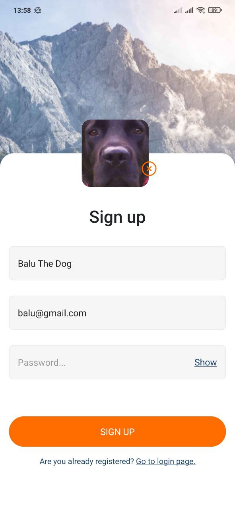

# Welcome to Social App!
While learning React Native, I developed a social network project for publishing photos. Authorization and management of image collections and comments were implemented using Firebase Authentication and Firebase Cloud Firestore Database. 
The application has such features as registration and login, adding/modifying/deleting a user's avatar, adding posts and comments.

# Visual and technical part

## Registration page

- login, email, and password are required for registration

- optionally add a photo.

## Menu page

- The main page of the application, the posts of all users will be posted here

## Add post

- The page for creating a post requires access to the phone's camera to take a picture, or access to the storage to upload an image from the gallery

- All fields are required for publication, and you can optionally add your geolocation

## Menu page with the publication

- Now you can add a comment right after creating a post

# Comments page

- Enter the text in the text field and click the arrow, after which a comment is created with the entered text and date

### Menu page with the publication and comments

## Profile page

- This page shows the posts of the current user and allows you to add or change the user's avatar

- To change the photo, you need to delete the old one by clicking on the cross, and then click on the plus sign

## Now let's change the user and create a publication

## Map page

- If the user has added geolocation, clicking on the address will take you to the map page with the marker where the photo was posted

## Validation and notification of authorization errors

- If you did not correctly fill in the registration or login data and an error occurred, you will be notified

